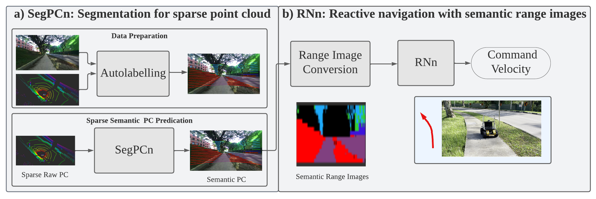
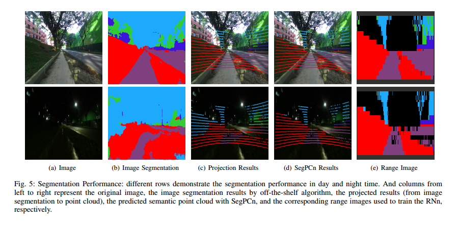

# Sidewalk Navigation with Sparse Semantic Point Cloud



- ```pc_seg``` directory provides scripts to 
  - train different variants of PointNet for point segmentation (Original PointNet, light version of PointNet, both of them are only accounting for the x,y,z information of point cloud, and our model)
  - run the navigation test on robot with different types of sensor input (image, point cloud and random controller etc.) and pretrained model


- ```prepare_data``` directory provides scripts to
  - extract different types of data (images, pointclouds etc.) from rosbag
  - manually split a whole dataset into train and test part and generate list file respectively
  - autolabel the sparse point cloud with the semantic cue from images, which is generated with an off-the-shelf image segmentation neural network.

- The dataset we used to train and test the proposed method can be downloaded through [nanyang_link at NTU](https://drive.google.com/file/d/19jlJjrdp_5CfxelZEjouCHW9srt6EP9C/view?usp=sharing), which are generated from recorded rosbag files and the platform is Husky A200 associatedd with Velodyne PUCK and ZED RGB-D camera for collecting data in nanyang link route from NTU, Singapore.

- ```range_image``` directory illustrates scripts to
  - train the Reactive Navigation network based on CNN-LSTM structure, where spatio-temporal information are maintained as much as possible. And the semantic point cloud has been transferred firstly to semantic range image before fed to network.

## Prerequesite 
- Ubuntu 20.04 with noetic ROS (since the default version in noetic is python3, and the code works properly with python3. You can also install anoconda in previsions of ros for running it)
- Anoconda 3.0
- pytorch

## Instructions
### 1. Autolabelling the semantic point cloud 
Launch a ros master
- #### roscore 

Transfer the compressed images to raw ones
- #### rosrun image_transport republish compressed in:=/camera/left/image_raw raw out:=/camera/left/image_raw  

Set the rosparam
- #### rosparam set use_sim_time true

Generate the semantic point cloud and store the corresponding associated data (image, semantic image, raw PC, semantic PC, twist, etc per what you required)
- #### python cam_lidar_fusion.py

Republish the twist massage to odom message
- #### python ./republisher.py

Replay the rosbag which you recorded, we have open sourced the generated dataset for sidewalk scenarios [nanyang_link at NTU](https://drive.google.com/file/d/19jlJjrdp_5CfxelZEjouCHW9srt6EP9C/view?usp=sharing)
- #### rosbag play  --clock *.bag

### 2. Train pointnet variants network: SegPCn
#### python ./pc_seg/scripts/point_train.py --mode train --model_name pointnet

### 3. Train the RNn
#### python ./range_image/train.py


## Results
1. Qualitative and Quantitative Performance of Semantic point cloud network
 <dev align=center>

2. Qualitative of RNn, evaluated in sidewalk scenarios with two baselines： CNN & Random


Please refer to our IROS 2022 paper for more details, which would be published soon.

